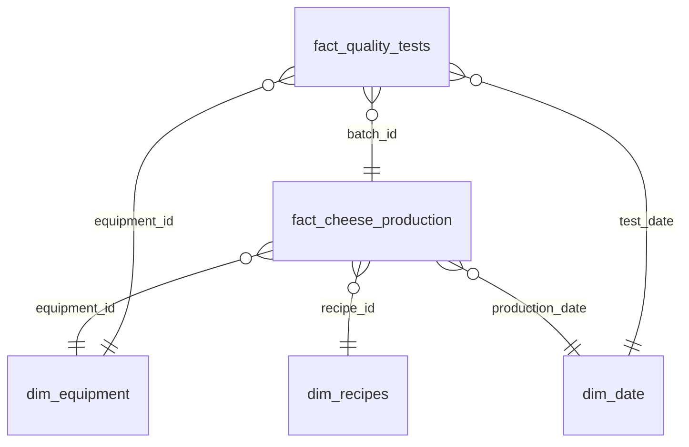
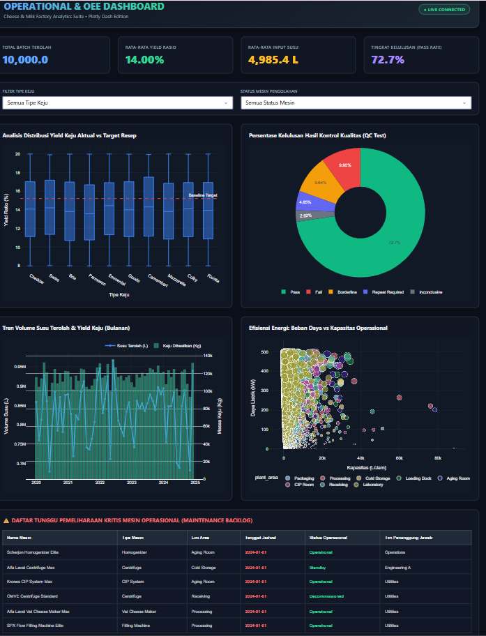

# Cheese & Milk Factory Operations Analytics Suite

An enterprise-grade **Exploratory Data Analysis (EDA) and Business Intelligence (BI)** portfolio project. It transforms raw, disconnected industrial dairy datasets into a structured, relational **Star Schema SQLite database** via a robust automated Python **ETL Pipeline**, backed by an interactive **Plotly Dash web dashboard** and data-driven insights.

---

## 🗺️ Project Architecture

```
[Raw CSVs] 
    │
    ▼
[etl_pipeline.py] ──────────► [factory_operations.db] (SQLite Star Schema)
                                    │
                                    ▼
                              [eda_analysis.py] ───► [visualizations/] (PNG Plots)
                                    │
                                    ▼
                              [dashboard.py] (Interactive Plotly Dash Web App)
```

---

## 📂 File Directory

* `ds1_*.csv` through `ds5_*.csv`: Raw industrial enterprise mock datasets (10,000 rows each).
* `factory_operations.db`: SQLite database built using custom relational Star Schema OLAP structures.
* `etl_pipeline.py`: Automated pipeline script handling Extract, Transform (remapping keys, sanitizing nulls, building calendar dimensions), and Load.
* `eda_analysis.py`: Python script performing exploratory statistical queries and generating data visualizations.
* `dashboard.py`: Modern, fully interactive dark-themed Plotly Dash dashboard with responsive sidebar filters and SQLite callbacks.
* `eda_insights_report.md`: High-value analytical insights report on yield deficits, energy loads, instrument calibration outcomes, and maintenance backlogs.
* `visualizations/`: Generated PNG charts used in reports and portfolios.

---

## 📐 Star Schema Model (OLAP)

The database utilizes **2 Fact Tables** and **3 Dimension Tables** mapping operational manufacturing pipelines:



---

## ⚙️ Setup and Installation

### 1. Clone & Install Dependencies
Ensure you have Python 3.8+ installed, then install required libraries:
```bash
pip install -r requirements.txt
```

### 2. Run the Data Pipeline
Reconstruct and clean the database from raw CSVs:
```bash
python etl_pipeline.py
```

### 3. Generate Analytical Insights
Calculate business statistics and update visual plots:
```bash
python eda_analysis.py
```

### 4. Launch the Interactive Dashboard
Fire up the Plotly Dash local server:
```bash
python dashboard.py
```
Open **[http://127.0.0.1:8050/](http://127.0.0.1:8050/)** in your web browser to play with filters, charts, and backlog alerts!


---

## 📊 Core Business Analytical Cases Covered
1. **Cheese Yield Deficit**: Identifying that all cheese varieties suffer from a yield deficit compared to their target formulation sheet, with **Ricotta showing the worst shortfall (2.87% below target)**.
2. **QC Calibration Risk**: Proving that overdue/uncalibrated lab sensors generate a high rate of unhelpful **Borderline (10.12%)** outcomes, increasing the risk of shipping spoiled batches.
3. **Preventive Maintenance Backlog**: Alerting operations teams to critical machines that have exceeded their maintenance due dates, preventing catastrophic line shutdowns.
