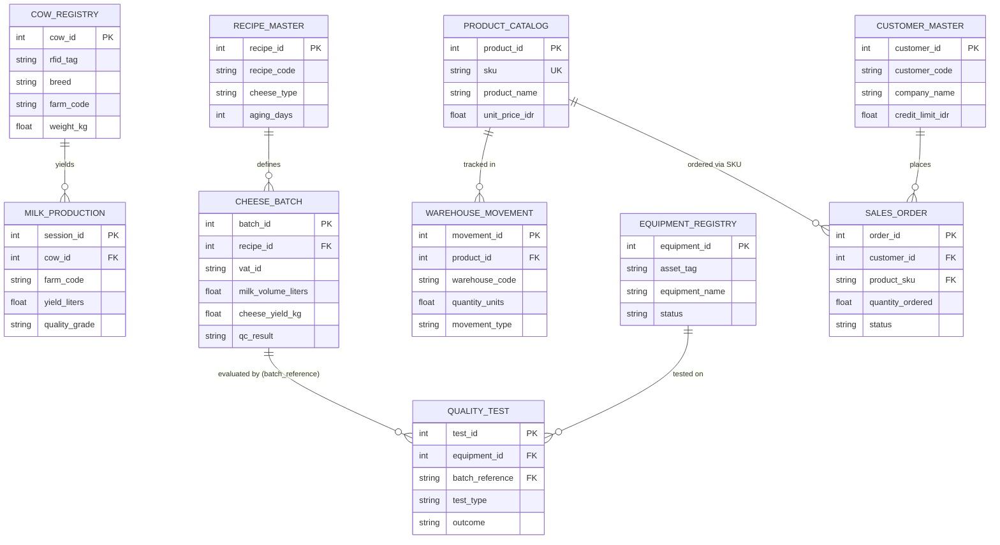

# Cheese & Milk Factory: Comprehensive Dataset Review

This document provides a highly detailed, professional, and visually structured review of all 10 datasets residing in the **Cheese & Milk Factory** workspace. 

---

## 🗺️ Data Map & Entity Relationship Diagram

The datasets form a cohesive, enterprise-grade system structured around **5 domains** (Domain 1 through Domain 5). The entities represent the end-to-end workflow of a dairy processing and distribution enterprise—from cow registry and milking to manufacturing, warehousing, quality assurance, and sales.



---

## 📊 File Matrix Overview

All datasets contain exactly **10,000 rows** of mock enterprise data, allowing deep relational integrity and statistics tracking across a wide temporal range.

| Dataset Name | Domain | Size (KB) | Row Count | Core Key(s) | Primary Focus |
| :--- | :--- | :--- | :--- | :--- | :--- |
| [ds1_cow_registry.csv](file:///c:/Users/hpvic/OneDrive/Documents/Cheese%20&%20Milk%20Factory/ds1_cow_registry.csv) | 🥛 D1: Milk Production | 1,614.96 KB | 10,000 | `cow_id` | Cow health, breeds, weight, genetics, and lactation tracking. |
| [ds1_milk_production.csv](file:///c:/Users/hpvic/OneDrive/Documents/Cheese%20&%20Milk%20Factory/ds1_milk_production.csv) | 🥛 D1: Milk Production | 1,387.62 KB | 10,000 | `session_id`, `cow_id` | Individual milking sessions, yields, operators, and quality parameters. |
| [ds2_cheese_batch.csv](file:///c:/Users/hpvic/OneDrive/Documents/Cheese%20&%20Milk%20Factory/ds2_cheese_batch.csv) | 🧀 D2: Cheese Batching | 1,665.12 KB | 10,000 | `batch_id`, `recipe_id` | Manufacturing logs of cheese batches, yields, chemistry, and aging rooms. |
| [ds2_recipe_master.csv](file:///c:/Users/hpvic/OneDrive/Documents/Cheese%20&%20Milk%20Factory/ds2_recipe_master.csv) | 🧀 D2: Cheese Batching | 1,597.13 KB | 10,000 | `recipe_id` | Formulation parameters, required milk, culture, and certifications. |
| [ds3_product_catalog.csv](file:///c:/Users/hpvic/OneDrive/Documents/Cheese%20&%20Milk%20Factory/ds3_product_catalog.csv) | 📦 D3: Warehousing | 1,662.55 KB | 10,000 | `product_id`, `sku` | SKUs, unit prices, weight, specifications, storage requirements. |
| [ds3_warehouse_movement.csv](file:///c:/Users/hpvic/OneDrive/Documents/Cheese%20&%20Milk%20Factory/ds3_warehouse_movement.csv) | 📦 D3: Warehousing | 1,759.86 KB | 10,000 | `movement_id`, `product_id` | Logistics logs, cold-chain checks, inventory adjustment types. |
| [ds4_equipment_registry.csv](file:///c:/Users/hpvic/OneDrive/Documents/Cheese%20&%20Milk%20Factory/ds4_equipment_registry.csv) | 🛠️ D4: Maintenance/QA | 2,148.16 KB | 10,000 | `equipment_id` | Asset valuation, locations, scheduled checks, capacity, and responsible teams. |
| [ds4_quality_test.csv](file:///c:/Users/hpvic/OneDrive/Documents/Cheese%20&%20Milk%20Factory/ds4_quality_test.csv) | 🛠️ D4: Maintenance/QA | 1,750.82 KB | 10,000 | `test_id`, `equipment_id` | Analytical quality tests (Microbiology, fat/protein assays, pasteurization). |
| [ds5_customer_master.csv](file:///c:/Users/hpvic/OneDrive/Documents/Cheese%20&%20Milk%20Factory/ds5_customer_master.csv) | 💼 D5: Sales & CRM | 1,947.80 KB | 10,000 | `customer_id` | B2B customers, credit limits, payment terms, and regions. |
| [ds5_sales_order.csv](file:///c:/Users/hpvic/OneDrive/Documents/Cheese%20&%20Milk%20Factory/ds5_sales_order.csv) | 💼 D5: Sales & CRM | 1,644.04 KB | 10,000 | `order_id`, `customer_id` | Transactions, invoicing, warehouse dispatches, discounts, and order state. |

---

## 🔍 Detailed Domain & Dataset Analysis

---

### 🥛 Domain 1: Milk Production & Registry

#### 1. `ds1_cow_registry.csv`
* **Purpose**: Tracks individual cows, biological traits, geographic farm assignment, and health metrics.
* **Fields & Specifications**:
  * `cow_id` (Integer): Unique ID for each cow. (0% Nulls)
  * `rfid_tag` (String): E.g., `RF922968202` (0% Nulls)
  * `breed` (String): 8 unique breeds (e.g., *Holstein, Jersey, Montbéliarde, Ayrshire, Normande, Milking Shorthorn*).
  * `farm_code` (String): 40 unique farms represented (e.g., `FARM-014`).
  * `region` (String): 8 unique regions across Indonesia (e.g., *West Java, East Java, Central Java, North Sumatra, Bali, Yogyakarta*).
  * `health_status` (String): *Excellent, Good, Fair, Poor, Under Treatment*.
  * `feed_program` (String): 6 unique configurations (e.g., *Hay-Based, Premium Silage, Concentrate Rich, Pasture-Fed, Organic Blend*).
  * `weight_kg` (Decimal): Dynamic weights (range ~300 to ~650 kg).
  * `lactation_number` (Integer): Ranges 1 to 5.
  * `avg_daily_yield_liters` (Decimal): Ranges from 15L to 35L.
  * `is_pregnant` (String): *Yes / No*.
  * `vaccination_status` (String): *Up-to-date, Partial, Overdue*.
  * `milk_fat_pct` / `milk_protein_pct` (Decimal): Average biological compositions.
  * `somatic_cell_count` (Integer): Quality indicator. (Range ~50,000 to ~800,000 cfu/ml).
  * `is_active` (String): *Yes / No*.
  * `notes` (String, **16.82% Nulls**): General qualitative descriptions like *"Excellent genetics"*, *"Recovering"*, *"Low yield alert"*.
* **Key Finding / Observation**: 
  > [!NOTE]
  > High Somatic Cell Counts (SCC) above 400,000 generally correlate with a status of `Under Treatment` or `Poor` health. This indicates a highly realistic simulated dataset.

---

#### 2. `ds1_milk_production.csv`
* **Purpose**: Milking transaction log checking each milking session, shift parameters, and physical parameters.
* **Fields & Specifications**:
  * `session_id` (Integer): Unique session identifier.
  * `cow_id` / `farm_code` (Identifiers): Core mapping to cow profiles.
  * `shift` (String): *Morning, Afternoon, Evening*.
  * `yield_liters` (Decimal): Measured output of the shift.
  * `fat_percentage` / `protein_percentage` / `lactose_percentage` (Decimal): Real-time lab readings per session.
  * `somatic_cell_count` (Integer): SCC reading per batch.
  * `temperature_celsius` (Decimal): Recorded temperature of milk (~38°C to 40°C).
  * `machine_id` (String): E.g., `MCH-17` (30 unique machines).
  * `operator_id` (Integer): Operator badge code (150 unique operators).
  * `ph_level` (Decimal): E.g., `6.42` to `6.87`.
  * `quality_grade` (String): *Grade A, Grade B, Grade C, Rejected*.
  * `is_flagged` (String): Flagging indicator (*Yes / No*).
* **Key Finding / Observation**:
  > [!WARNING]
  > Sessions showing high `temperature_celsius` (>39.5°C) or high somatic cell counts correspond to `Rejected` grades and `is_flagged = Yes`. This is a classic indication of mastitis or equipment contamination.

---

### 🧀 Domain 2: Cheese Batching & Recipes

#### 3. `ds2_cheese_batch.csv`
* **Purpose**: Tracks operational steps of turning raw milk into specific cheese variants.
* **Fields & Specifications**:
  * `batch_id` (Integer): Unique batch identifier.
  * `recipe_id` (Integer): Mapped to formulation sheet.
  * `vat_id` (String): 20 unique manufacturing vats (e.g., `VAT-06`).
  * `production_date` (String): Date of processing.
  * `start_timestamp` / `end_timestamp` (String): Track total batch runtime.
  * `milk_volume_liters` (Decimal): Input volume (approx 2,000L to 8,000L).
  * `cheese_yield_kg` (Decimal): Final output weight (ranges ~200 kg to ~1,200 kg).
  * `fat_pct_actual` / `moisture_pct_actual` / `ph_at_drain` / `temperature_curd_c` (Decimal): Real-time chemistry.
  * `starter_culture_ml` / `rennet_ml` (Decimal): Enzyme and inoculation input quantities.
  * `aging_room` (String): Dynamic room assignment (e.g., `AGE-10`).
  * `qc_result` (String): *Pass, Fail, Rework, Conditional Pass*.
  * `batch_notes` (String): Qualitative logs (*"Slight over-acidification"*, *"Normal batch"*, *"pH deviation"*).
* **Key Finding / Observation**:
  > [!IMPORTANT]
  > Moisture levels must align with the target style. For hard cheeses (e.g., Parmesan recipes), moisture must fall below 35%, whereas soft cheeses (e.g., Camembert) allow up to 75%. Deviations lead to `Rework` or `Fail`.

---

#### 4. `ds2_recipe_master.csv`
* **Purpose**: Master specifications list for cheese types and aging protocols.
* **Fields & Specifications**:
  * `recipe_id` (Integer): Unique profile key.
  * `recipe_code` (String): Product code (e.g., `RCP14193`).
  * `cheese_type` (String): E.g., *Ricotta, Gouda, Emmental, Colby, Mozzarella, Parmesan, Cheddar, Camembert, Swiss*.
  * `variant_name` (String): 80 unique sub-brands (e.g., *Camembert Artisan, Colby Reserve, Cheddar Bold*).
  * `origin_style` (String): *Indonesian Local, Fusion Modern, Dutch Heritage, French Artisan, Traditional Italian*, etc.
  * `aging_days` (Integer): *0, 14, 30, 90, 180, 365, 730* days.
  * `milk_type_required` (String): *Cow, Goat, Buffalo, Sheep, Mixed*.
  * `starter_culture` (String): *Mesophilic, Thermophilic, Washed Rind, Mold-Ripened, Mixed Culture*.
  * `coagulation_method` (String): *Rennet, Acid, Enzymatic, Heat-Acid*.
  * `yield_ratio_pct` (Decimal): Theoretical efficiency indicator (e.g., 10%-25%).
  * `certification` (String, **24.57% Nulls**): Product seals (*Halal, Organic, Halal+Organic, ISO22000, Kosher*).
  * `status` (String): *Active, Archived, Experimental, Discontinued, In Review*.
* **Key Finding / Observation**:
  * A clear direct relation exists between `aging_days` and `shelf_life_days`. Soft/Fresh styles (aging = 0-14 days) show extremely short shelf lives, requiring immediate cold chain preservation.

---

### 📦 Domain 3: Warehousing & Catalog

#### 5. `ds3_product_catalog.csv`
* **Purpose**: Unified SKU catalog for finished consumer goods.
* **Fields & Specifications**:
  * `product_id` (Integer) & `sku` (String): Unique identifiers.
  * `product_name` (String): E.g., *AlpineGold Fresh Milk Regular*, *NaturaLac Yogurt Full-cream*, etc.
  * `category` (String): E.g., *Fresh Milk, Yogurt, Whey Powder, UHT Milk, Ice Cream Mix, Butter, Cream, Condensed Milk*.
  * `brand` (String): 10 core house brands (e.g., *LactoFresh, GreenPasture, AlpineGold, NaturaLac*).
  * `unit_price_idr` (Decimal): E.g., IDR 9,300 to IDR 123,900.
  * `storage_temp_c` (Decimal): Range from `-20°C` (Ice cream mixes/butter) to `25°C` (UHT / milk powder).
  * `halal_certified` (String): *Yes / No / Pending*.
  * `supplier_code` (String): SUP code (80 unique suppliers).
  * `is_active` (String): *Yes / No*.
  * `min_order_qty` (Integer): E.g., 1, 5, 10, 12, 24, 100.
  * `weight_per_unit_g` (Integer): Ranges from 200g up to 25,000g (industrial bulk).

---

#### 6. `ds3_warehouse_movement.csv`
* **Purpose**: Tracks inventory inflow/outflow, cold chain storage limits, and dispatch logistics.
* **Fields & Specifications**:
  * `movement_id` (Integer): Log primary key.
  * `product_id` (Integer): Core relation to SKU catalog.
  * `warehouse_code` (String): 15 physical locations (e.g., `WH-10`, `WH-02`).
  * `movement_type` (String): *Inbound, Outbound, Transfer, Adjustment, Sample, Return*.
  * `quantity_units` (Decimal): Size of movement.
  * `unit_cost_idr` / `total_value_idr` (Decimal): Cost analysis.
  * `lot_number` (String): Lot traceability key (e.g., `LOT24215524`).
  * `temperature_log_c` (Decimal): Log of shipping/holding container temperature.
  * `humidity_pct` (Decimal): Relative humidity.
  * `is_quarantine` (String): *Yes / No*.
  * `remarks` (String): Quality state flags (*"OK", "Near expiry", "Cold chain breach", "Overstock", "Backorder fill"*).
* **Key Finding / Observation**:
  > [!CAUTION]
  > Logistics items with `remarks = "Cold chain breach"` correlate with high `temperature_log_c` metrics that exceed the SKU's maximum storage temperature, trigger automatic quarantined flag (`is_quarantine = Yes`).

---

### 🛠️ Domain 4: Maintenance & Quality Assurance

#### 7. `ds4_equipment_registry.csv`
* **Purpose**: Comprehensive list of heavy industrial factory machinery and assets.
* **Fields & Specifications**:
  * `equipment_id` (Integer): Unique asset code.
  * `asset_tag` (String): E.g., `AST625613` (0% Nulls)
  * `equipment_name` (String): E.g., *Paul Mueller Pasteurizer Elite, Pasilac Butter Churn Mini, OMVE Dryer Pro*, etc.
  * `equipment_type` (String): E.g., *Vat Cheese Maker, Pasteurizer, Butter Churn, Homogenizer, Cooling Tank, Dryer*, etc.
  * `installation_date` / `last_maintenance_date` / `next_maintenance_due` (String): Preventive maintenance calendars.
  * `capacity_liters_hr` (Decimal): Machine output rate.
  * `power_consumption_kw` (Decimal): Energy load tracking.
  * `status` (String): *Operational, Out of Service, Under Maintenance, Decommissioned, Standby*.
  * `maintenance_contract` (String, **25.06% Nulls**): Service levels (*Full Service, Parts Only, Labour Only, None*).
  * `asset_value_idr` (Decimal): E.g. ~IDR 100M up to IDR 45B (industrial scale).
  * `responsible_team` (String): *Engineering A, Operations, Utilities, External Contractor, Engineering B*.

---

#### 8. `ds4_quality_test.csv`
* **Purpose**: Record of laboratory assays, critical microbial limits, and validation checks.
* **Fields & Specifications**:
  * `test_id` (Integer): Test unique key.
  * `equipment_id` (Integer): Evaluates clean-in-place (CIP) and processing standards on specific assets.
  * `batch_reference` (String): Maps to production batches.
  * `test_type` (String): *Microbial Count, Sensory Evaluation, Protein Assay, Fat Content, Pasteurization Efficiency, Allergen Screen*, etc.
  * `measured_value` (Decimal): Laboratory output metric.
  * `unit_of_measure` (String): E.g., `AU, °C, pH, NTU, log10 cfu/g`.
  * `lower_spec_limit` / `upper_spec_limit` (Decimal): Compliance boundaries.
  * `outcome` (String): *Pass, Fail, Inconclusive, Repeat Required, Borderline*.
  * `analyst_id` (Integer): Badge of the lab technician.
  * `lab_room` (String): Lab site (*QC-Floor, Lab-A, Lab-B, Mobile Unit, External Lab*).
  * `instrument_calibrated` (String): *Yes / No / Overdue*.
  * `remarks` (String): Detailed comments (*"Within spec"*, *"Trending up"*, *"Equipment recalibrated"*, *"Confirmed fail"*).

---

### 💼 Domain 5: Sales & Customer Relationship

#### 9. `ds5_customer_master.csv`
* **Purpose**: Directory of corporate partners, distributors, hotels, and retail clients.
* **Fields & Specifications**:
  * `customer_id` (Integer): Unique B2B client ID.
  * `customer_code` (String): E.g., `CUST865887`.
  * `company_name` (String): E.g., *UD Jaya Persada, PT Makmur Mandiri, Toko Lestari Sejati*.
  * `segment` (String): *HoReCa (Hotel/Rest/Cafe), Industrial, Distributor, Export, Traditional Trade, E-Commerce*.
  * `tier` (String): *Gold, Silver, Bronze, Platinum, New*.
  * `credit_limit_idr` (Decimal): Financial safety bounds (~IDR 10M to IDR 200M).
  * `payment_terms_days` (Integer): *7, 14, 21, 30, 45, 60, 90* days.
  * `annual_revenue_idr` (Decimal): Customer baseline financial profile.
  * `preferred_delivery` (String): *Next Day, Weekly, 2-3 Days, Fortnightly, Monthly*.
  * `cold_chain_required` (String): *Yes / No*.
  * `email_domain` (String): E.g., *gmail.com, yahoo.com, outlook.com, company.co.id, business.id*.
  * `notes` (String): E.g. *"Growth potential"*, *"VIP"*, *"Slow payer"*, *"Dormant"*.

---

#### 10. `ds5_sales_order.csv`
* **Purpose**: Transaction engine recording ordering patterns, dispatch nodes, and payment states.
* **Fields & Specifications**:
  * `order_id` (Integer): Core transactional PK.
  * `customer_id` (Integer): B2B Client FK.
  * `product_sku` (String): Catalog item FK.
  * `quantity_ordered` / `quantity_delivered` (Decimal): Fill rates.
  * `unit_price_idr` (Decimal): Net transaction price.
  * `discount_pct` (Decimal): E.g., *0%, 5%, 10%, 15%, 20%, 30%*.
  * `gross_value_idr` / `net_value_idr` / `tax_idr` (Decimal): Absolute financial metrics.
  * `warehouse_dispatch` (String): Sourcing warehouse (e.g., `WH-02`).
  * `payment_status` (String): *Paid, Unpaid, Overdue, Disputed, Partial*.
  * `status` (String): *Processing, Cancelled, Invoiced, Delivered, On Hold*.
  * `remarks` (String): Order deviations (*"Price negotiated", "Bulk order", "Credit hold", "Complaint logged", "Late delivery"*).

---

## 🛠️ Data Integrity & Recommendations

Below is an analysis of critical anomalies found during the script evaluation, alongside recommended cleaning and data engineering steps:

1. **Notes & Certification Nulls**: 
   * **Location**: `ds1_cow_registry.csv` (`notes` column at **16.82%** nulls), `ds2_recipe_master.csv` (`certification` column at **24.57%** nulls), and `ds4_equipment_registry.csv` (`maintenance_contract` at **25.06%** nulls).
   * **Recommendation**: Implement default placeholders for missing database fields during ETL ingestion:
     ```sql
     COALESCE(notes, 'No remarks')
     COALESCE(certification, 'Standard / Uncertified')
     COALESCE(maintenance_contract, 'None / Ad-hoc')
     ```

2. **Supply Chain Under-fulfillment / Cancelled States**:
   * **Location**: `ds5_sales_order.csv`.
   * **Anomaly**: Several records show `quantity_ordered > 0` but `quantity_delivered = 0`, specifically matching orders marked as `On Hold` due to `"Credit hold"` or cancelled states.
   * **Recommendation**: Create a derived flag in your analytics pipeline called `fill_rate_percentage` to identify supply-chain leakage:
     ```python
     df['fill_rate'] = (df['quantity_delivered'] / df['quantity_ordered']).fillna(0.0)
     ```

3. **Cold Chain Enforcement**:
   * **Location**: Cross-referencing `ds3_product_catalog.csv` (`storage_temp_c`), `ds3_warehouse_movement.csv` (`temperature_log_c`), and `ds5_customer_master.csv` (`cold_chain_required`).
   * **Recommendation**: Create an automatic alert pipeline for movement temperature records where `temperature_log_c > storage_temp_c`. These breaches require immediate physical quarantine of the relevant batch.

---

### 📂 File Locations & Review Artifact

The complete programmatic analysis code and processed stats are archived at:
* **Analysis Scratch Script**: [analyze_datasets.py](file:///C:/Users/hpvic/.gemini/antigravity-ide/brain/c3f03dc5-e37e-4663-844e-d9ab1b5ababb/scratch/analyze_datasets.py)
* **Raw Extracted Stats JSON**: [analysis_results.json](file:///C:/Users/hpvic/.gemini/antigravity-ide/brain/c3f03dc5-e37e-4663-844e-d9ab1b5ababb/scratch/analysis_results.json)
* **This Main Review**: [dataset_review.md](file:///C:/Users/hpvic/.gemini/antigravity-ide/brain/c3f03dc5-e37e-4663-844e-d9ab1b5ababb/dataset_review.md)
