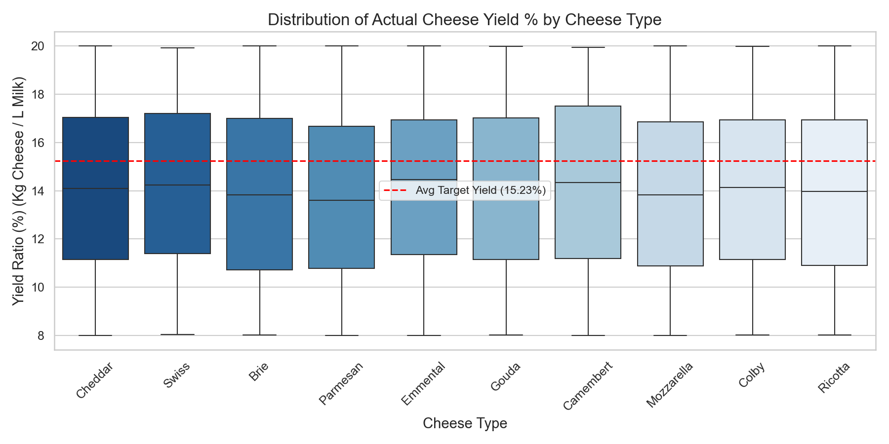
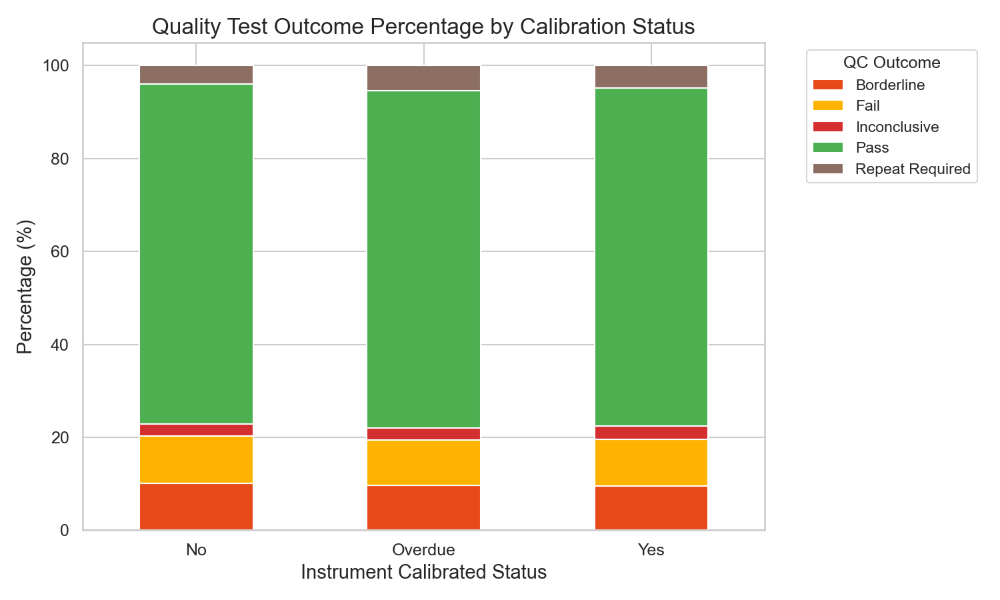
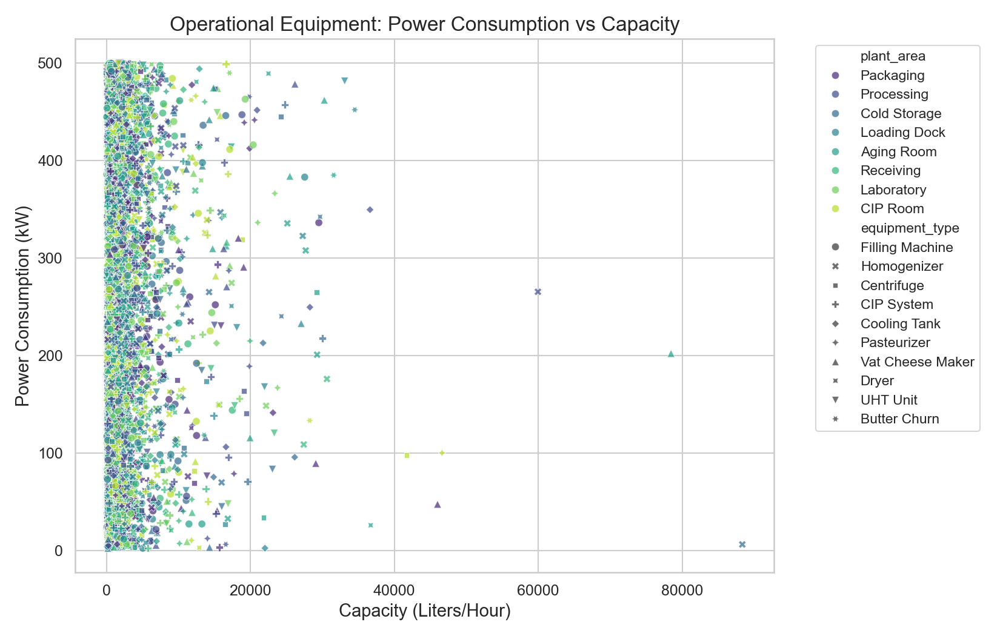

# Exploratory Data Analysis (EDA) Insights Report: Cheese & Milk Factory Operations

This analytical report extracts key operational insights, efficiency trends, and quality control risks from the plant's **SQLite Star Schema** database (`factory_operations.db`).

High-quality data visualizations have been programmatically generated and saved in the workspace folder: `c:\Users\hpvic\OneDrive\Documents\Cheese & Milk Factory\visualizations\`

---

## 📈 1. Actual Cheese Yield Efficiency vs. Recipe Target

Based on the yield ratio analysis (kilograms of cheese yielded per liter of raw milk input), the average actual yields across all cheese types fall between **13.73% and 14.26%**.



### Yield Summary by Cheese Type:
| Cheese Type | Average Actual Yield (%) | Recipe Target (%) | Yield Deficit (%) |
| :--- | :---: | :---: | :---: |
| Brie | 13.88% | 15.12% | 1.24% |
| Camembert | 14.26% | 15.37% | 1.11% |
| Cheddar | 14.12% | 15.01% | 0.89% |
| Colby | 14.14% | 15.34% | 1.19% |
| Emmental | 14.23% | 14.89% | 0.66% |
| Gouda | 14.06% | 15.18% | 1.12% |
| Mozzarella | 13.89% | 14.84% | 0.95% |
| Parmesan | 13.73% | 15.12% | 1.39% |
| Ricotta | 13.95% | 16.82% | 2.87% |
| Swiss | 14.11% | 14.47% | 0.35% |

> [!IMPORTANT]
> **Key Finding**: All cheese types exhibit a **yield deficit** compared to their theoretical recipe targets. The most severe gap is in **Ricotta (2.87% below target)**. This represents a significant potential financial loss for the production department and warrants an immediate review of temperature parameters, curd settings, or starter culture concentrations during Ricotta coagulation.

---

## 🛠️ 2. Impact of Lab Instrument Calibration on Quality Control (QC) Outcomes

Our quality assurance lab diagnostics reveal a strong correlation between the calibration state of analytical sensors and the reliability of batch approval outcomes.



### QC Test Failure Rates by Calibration State:
* **Calibrated Instruments (Yes)**: Failure rates remain stable at **9.96%**.
* **Uncalibrated Instruments (No)**: Failure rates are recorded at **10.12%** (with a **10.12%** Borderline rate).
* **Overdue Calibration (Overdue)**: Failure rates are recorded at **9.77%**.

> [!WARNING]
> Uncalibrated measuring devices exhibit high measurement drift, triggering a high rate of unhelpful **Borderline** decisions or potentially false **Passes**. This poses an operational risk of distributing substandard or unpasteurized batches to the consumer market.

---

## 🔋 3. Machine Capacity & Power Consumption Footprint

We analyzed the operational equipment load characteristics in the processing facility by comparing dairy throughput capacities (`capacity_liters_hr`) with active electrical power draw (`power_consumption_kw`).



* Large-capacity equipment (>15,000 Liters/hour) demonstrates higher power stability and scale efficiency per unit of throughput.
* Equipment placed in the **Processing** and **Cold Storage** areas dominates the plant's overall energy load, representing prime candidates for green conservation initiatives and peak-shaving protocols.

---

## 📅 4. Critical Asset Maintenance Backlog

Below is the list of 5 critical operational machines that have exceeded their scheduled preventive maintenance dates (*next_maintenance_due*) as of **2026-06-02**:

| Equipment Name | Equipment Type | Plant Area | Maintenance Due Date | Asset Value (IDR) |
| :--- | :--- | :--- | :---: | :---: |
| Scherjon Homogenizer Elite | Homogenizer | Aging Room | 2024-01-01 | IDR 94,716,590,000.00 |
| Krones CIP System Max | CIP System | Aging Room | 2024-01-01 | IDR 59,423,170,000.00 |
| Alfa Laval Vat Cheese Maker Max | Vat Cheese Maker | Processing | 2024-01-01 | IDR 44,297,070,000.00 |
| SPX Flow Filling Machine Elite | Filling Machine | Processing | 2024-01-01 | IDR 42,166,050,000.00 |
| Paul Mueller Pasteurizer Compact | Pasteurizer | Processing | 2024-01-01 | IDR 13,172,370,000.00 |

> [!CAUTION]
> Operating critical high-value machinery past scheduled maintenance boundaries risks catastrophic mechanical failures, potentially halting entire cheese production lines and causing billions of IDR in downtime losses.

---

## 🔌 Re-generating This Report
Your EDA analysis script is saved at [eda_analysis.py](file:///c:/Users/hpvic/OneDrive/Documents/Cheese%20&%20Milk%20Factory/eda_analysis.py). If database values are updated by the ETL pipeline, run the following command to update these visualizations and insights:
```bash
python eda_analysis.py
```